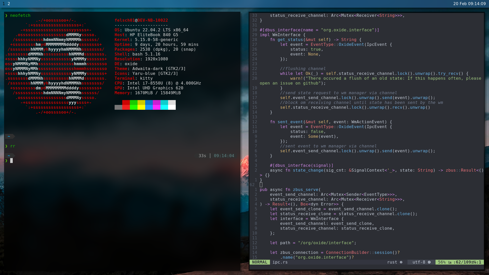

# *Software Engineering* project - OxideWM


[](https://github.com/DHBW-FN/OxideWM/actions/workflows/rust_test.yml)
<!-- -->



## Installation

1. Clone the Oxide git repository:

```bash
git clone https://github.com/DHBW-FN/OxideWM.git
```

2. Install Oxide via make:

```bash
cd OxideWM
make install
```

Sudo privileges are required to install Oxide.
After installation you can quit your current X session and log out. Subsequently Oxide should be selectable as window manager in your login screen.

## Documentation

- [OxideWM - ReadTheDocs](https://oxide.readthedocs.io/en/latest/)

## Logging

To change log level, set environment variable `OXIDE_LOG=[error, info, debug, trace]` changes affect only after restart... .
Logs will always be written to `/var/log/syslog`.
When project is built without `--release` flag, the logs are additionally written to `stdout` and to `log/*.log`.
